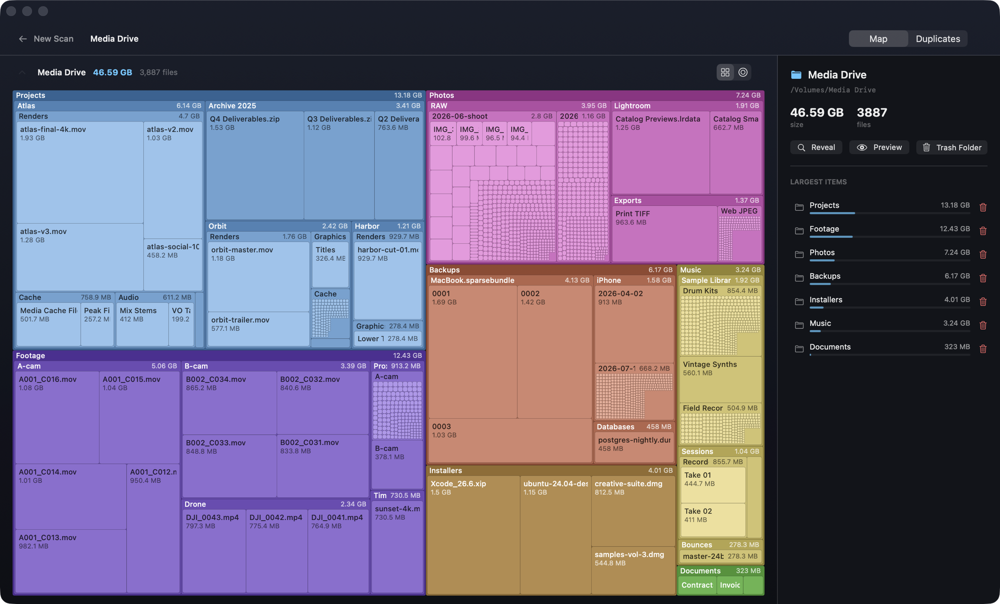

# UnDupe

A fast, native macOS app that shows what's using your disk — and safely clears
the duplicates.



## What it does

- **Disk map** — every folder and file is a rectangle sized by its share of the
  disk. Click to zoom in, ⌘↑ to go back up. A radial sunburst view is one click
  away in the toolbar.
- **Duplicate finder** — size → 4 KB prefix hash → full SHA-256, so a file is
  never fully hashed without a match. Hard links are collapsed, and a set always
  keeps at least one copy.
- **System cleanup** — startup items, extensions, caches and logs, and an app
  uninstaller that finds an app's leftovers by bundle ID rather than guessing.
- **Safe by default** — deletions go to the Trash through a single guard that
  refuses system paths and app internals, and ⌘Z puts the last one back.
- **Fast** — directory metadata is read in bulk via `getattrlistbulk(2)` instead
  of a `stat()` per file: about 37,000 files in 0.3 seconds.

Right-click anything — in the map, the inspector or the duplicate list — to
open, Quick Look, reveal in Finder, copy the path, or trash it.

## Install

Download the latest `.dmg` from [Releases](../../releases) and drag UnDupe to
Applications. It's signed with a Developer ID and notarized, so it opens with a
normal double-click.

Requires macOS 13 or later. Universal: Apple silicon and Intel.

UnDupe keeps itself current from **UnDupe ▸ Check for Updates…**. An update
installs only if it's signed by the same developer certificate as the copy
already running.

### Full Disk Access

UnDupe is not sandboxed — a disk scanner has to read what you point it at. To
scan beyond your home folder, add it under **System Settings ▸ Privacy &
Security ▸ Full Disk Access**. Without the grant it still runs, and says so when
totals are incomplete.

## Build from source

```bash
Scripts/build-app.sh release   # build build/UnDupe.app
swift test                     # requires full Xcode
swift run undupe-scan ~/Downloads   # headless engine, for comparing against du
```

`Scripts/build-app.sh --dist` produces a signed, notarized, universal `.dmg`.

## Under the hood

A pure engine (`UnDupeCore`) with no UI dependencies, and a SwiftUI app that
consumes it. All filesystem, scanning and hashing logic lives in the engine.
**[docs/ARCHITECTURE.md](docs/ARCHITECTURE.md)** covers the bulk-metadata
scanner, volume boundaries, the duplicate funnel, the deletion guard, the
squarified treemap and the update security model.

## Known limitations

- Hard links are counted per link in directory **totals**, so a tree like `/usr`
  can read ~1.5% above `du`. The duplicate finder doesn't have this problem.
- The disk map is drawn on a `Canvas` and isn't reachable by VoiceOver yet; the
  inspector and lists are.
- Undo covers the most recent trash only.

## License

MIT — see [LICENSE](LICENSE).
